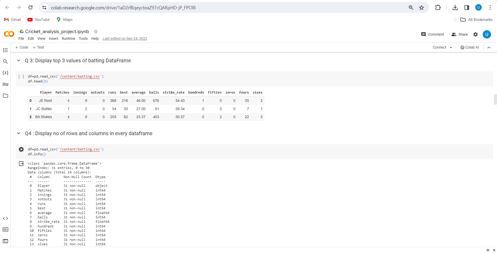
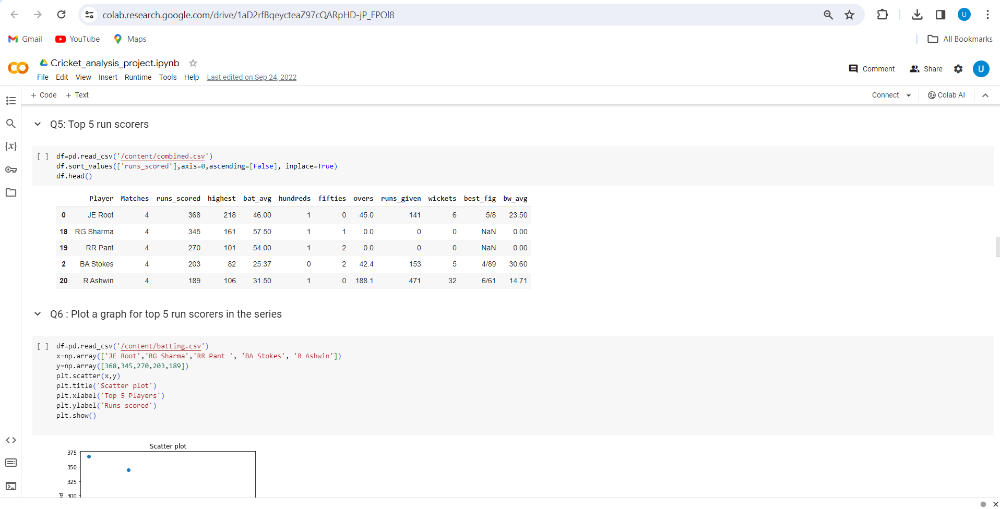
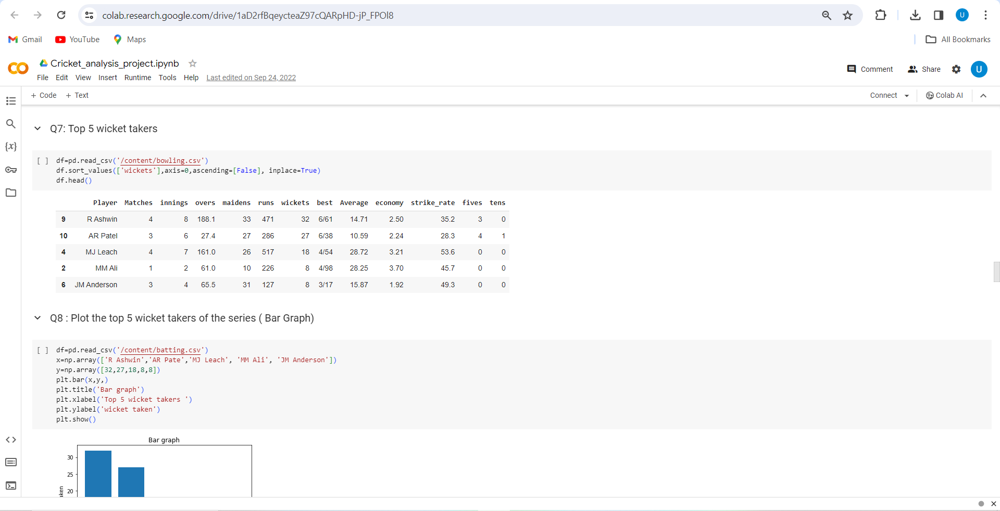
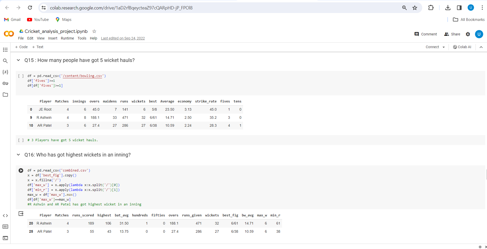
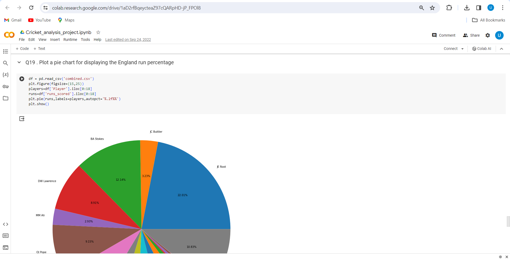

# Cricket Dataset Analysis
- This was one of my projects as a part of Rinex AI training and Internship done in my 1st year of Engineering
- This project deep dives into the provided cricket dataset and displays various insights.
- It involves determining the appropriate rows or graphs for answering the given questions

